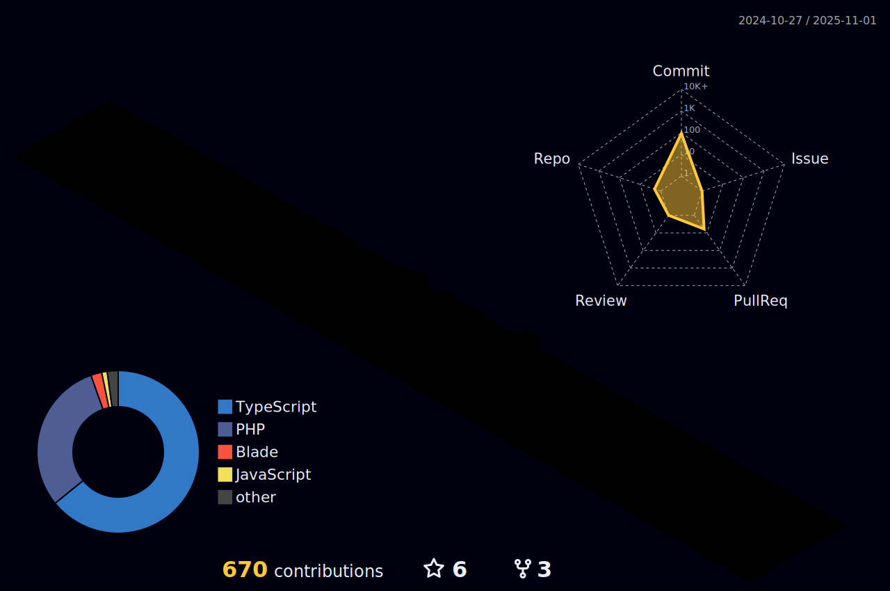

<h1 align="center">Hi!  I'm Luis</h1>
<h3 align="center">Full Stack Software Engineer</h3>
<h3 align="center">
</h3>
 
 

  

- 👋 Hello! I'm Luis Colón, a resident of Puerto Rico.
- 👀 I'm passionate about coding and currently focused on React development. Additionally, I'm exploring the realms of UI/UX and product design.
- 📫 Feel free to connect with me on Twitter, Instagram, and LinkedIn.
- I've recently graduated from Holberton's foundation year and I've also worked as a Student Tutor. 

<h2> Connect with me  </h2>
 
 

 

<!---
luiscolon0426/luiscolon0426 is a ✨ special ✨ repository because its `README.md` (this file) appears on your GitHub profile.
You can click the Preview link to take a look at your changes.
--->
<h2> Languages  </h2>

 
 
 
                                                                                                                                                       </a>
 
  </a>
 

 

<h2> Tools   </h2>

</a>

 </a>

 
                                                                                   

                                                                                                                                         
## &#x1f4c8; GitHub Stats

 

 

        
 
 &emsp;&emsp;&emsp;&emsp;&emsp; &emsp;&emsp; &emsp;&emsp;&emsp;&emsp;&emsp;&emsp;&emsp; 

 

---

                                                                                                                                        
---

